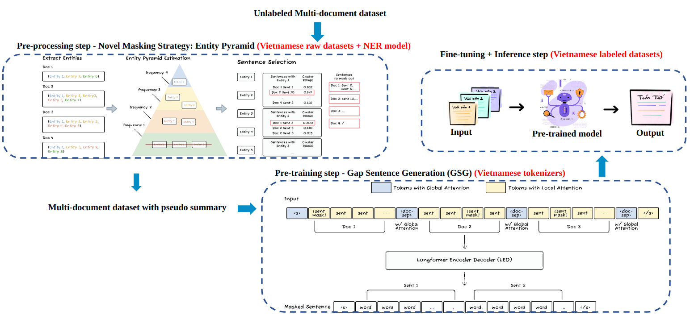

# LatVis: Large-scale Task-specific Language Model for Low-resource Vietnamese Multi-document Summarization

### Introduction
We introduce LatVis, a large-scale task-specific language model that specifically pre-trained for Vietnamese multi-document summarization (MDS) task and a Vietnamese multi-document labeled dataset with ∼10,000 samples. To the best of our knowledge, we introduce one of the very first public larger-size MDS dataset and public language model that designed for Vietnamese MDS task and proves to be a potential approach for natural language processing tasks in less-resourced languages. 

### Model
We use the official code for PRIMERA [[1]](#1) and use our pipeline to make it be able to work on Vietnamese text summarization datasets. The model can support up to 16K tokens.

### Dataset
At the early phase of this project, due to the lack of Vietnamese unlabeled multi-document dataset, we divided the Newscorpus [[7]](#7) into smaller parts and translated Newshead [[8]](#8) using Google Translate API and ultilized it as our pretraining dataset. 

Below is the statistics of Vietnamese unlabeled dataset: 

| Dataset | Newscorpus | Newshead | 
| :----------- | :-----------: | :-----------: | 
| Total clusters | 5778893 | 314033 | 
| Total articles | 17847516 | 1065571 | 
| Average length per article |  154.03 | 2925.55 |
| Average number of entities per article | 4.87 | 23.67 | 

Currently, only three Vietnamese MDS datasets are available, posing a significant challenge for research advancement in this domain. These MDS datasets such as VMDS [[2]](#2), ViMs [[3]](#3), and VLSP [[4]](#4) seem to be quite small. Therefore, to enrich the Vietnamese multi-document datasets resource, we translated WCEP [[6]](#6) - a dataset for MDS consists of short, human-written summaries about news events using gpt-3.5-turbo-16k model from OpenAI and spent hours manually curating the dataset. 

Below is the statistics of Vietnamese unlabeled dataset: 

| Dataset | WCEP [[6]](#6) | vi-WCEP | 
| :----------- | :-----------: | :-----------: | 
| Number of documents | 10K | 10K | 
| Average number of documents per cluster |  9.1 | 9.1 |
| Average number of words per cluster | 3866 | 4696 | 
| Average number of words per summary | 28 | 40 | 

You can download our dataset: [vi-WCEP](https://drive.google.com/drive/folders/1agrHbDDSz8HAcLmQ1cBr1SSDYTZ9jEpG?usp=drive_link)

### Evaluation

At our very early stage, we use Hugging Face [rouge score](https://huggingface.co/spaces/evaluate-metric/rouge) which is a wrapper around [Google Research reimplementation of ROUGE](https://github.com/google-research/google-research/tree/master/rouge) on VNDS [[5]](#5) - vietnamese benchmark for text summarization and our model achieves comparable performance with Vietnamese SOTA models. Later, we find out that the rouge scorer seem be to wrong with Vietnamese, below are result of Vietnamese SOTA model such as BARTPho [[10]](#10), ViT5 [[9]](#9) on VNDS [[5]](#5):

| Model | Rouge-1 F1 | Rouge-2 F1 | Rouge-L F1 | 
| :----------- | :-----------: | :-----------: | :-----------: |
| BARTPho [[10]](#10) | 61.14 | 30.31 | 40.15 |  
| ViT5 [[9]](#9) (our run) | **63.47** | **34.42** | **43.72** |  
| LatVis | __63.01__ | __33.38__ | __42.74__ | __46.38__ |

Therefore, for evaluation, we use [rouge scorer](https://github.com/pltrdy/rouge). We save our checkpoint model based on AVG.R F1.

Below are achieved results on some Vietnamese labeled datasets: 

+ VNDS [[5]](#5):

| Model | Rouge-1 F1 | Rouge-2 F1 | Rouge-L F1 | 
| :----------- | :-----------: | :-----------: | :-----------: |
| ViT5 [[9]](#9) (our run) | **38.46** | **22.90**| **32.82** |  
| LatVis (zero shot) | 24.63 | 10.30 | 19.72 |  
| LatVis | __37.43__ | __22.00__ | __31.78__ | 

+ vi-WCEP:

| Model | Rouge-1 F1 | Rouge-2 F1 | Rouge-L F1 | 
| :----------- | :-----------: | :-----------: | :-----------: |
| ViT5 [[9]](#9) (our run) |  |  |  |  
| LatVis (zero shot) | 22.62 | 7.66 | 19.53 |  
| LatVis | 39.08 | 20.33 | 33.47 | 30.96 |

### Future work

1. Crawl and build the large unlabeled Vietnamese multi-document dataset from scratch.
2. Upload source code, pretrained models.

    
### References
<a id="1">[1]</a> Wen Xiao, Iz Beltagy, Giuseppe Carenini, Arman Cohan. “PRIMERA: Pyramid-based Masked Sentence Pre-training for Multi-document Summarization”. In: Proceedings of the 60th Annual Meeting of the Association for Computational Linguistics. Vol. 1. 2022, pp. 5245–5263.

<a id="2">[2]</a> Trần Mai Vũ, Vũ Trọng Hóa, Phí Văn Thủy, Lê Đức Trọng, Hà Quang Thụy. "VietnameseMDS
:200 Cụm văn bản tiếng Việt dùng cho tóm tắt đa văn bản"

<a id="3">[3]</a> Tran, Nhi-Thao and Nghiem, Minh-Quoc and Nguyen, Nhung TH and Nguyen, Ngan Luu-Thuy and Van Chi, Nam and Dinh, Dien. "ViMs: a high-quality Vietnamese dataset for abstractive multi-document summarization". In: Language Resources and Evaluation. Vol. 54, Num. 4, pp. 893-920. 2020.

<a id="4">[4]</a> Mai-Vu Tran, Hoang-Quynh Le, Duy-Cat Can, Quoc-An Nguyen. "VLSP 2022 – ABMUSU Challenge: Vietnamese Abstractive multi-document summarization". In Proceedings of the 9th International Workshop on Vietnamese Language and Speech Processing (VLSP 2022).

<a id="5">[5]</a> https://github.com/ThanhChinhBK/vietnews

<a id="6">[6]</a> Demian Gholipour Ghalandari, Chris Hokamp, Nghia-The Pham, John Glover, Georgiana Ifrim. "A Large-Scale Multi-Document Summarization Dataset from the Wikipedia Current Events Portal". In Proceedings of the 58th Annual Meeting of the Association for Computational Linguistics.

<a id="7">[7]</a> https://github.com/binhvq/news-corpus

<a id="8">[8]</a> Gu, Xiaotao and Mao, Yuning and Han, Jiawei and Liu, Jialu and Yu, Hongkun and Wu, You and Yu, Cong and Finnie, Daniel and Zhai, Jiaqi and Zukoski, Nicholas. "Generating Representative Headlines for News Stories". Proc. of the the Web Conf. 2020

<a id="9">[9]</a> Phan, Long and Tran, Hieu and Nguyen, Hieu and Trinh, Trieu H. "ViT5: Pretrained Text-to-Text Transformer for Vietnamese Language Generation". In Proceedings of the 2022 Conference of the North American Chapter of the Association for Computational Linguistics: Human Language Technologies: Student Research Workshop

<a id="10">[10]</a> Nguyen Luong Tran and Duong Minh Le and Dat Quoc Nguyen. "BARTpho: Pre-trained Sequence-to-Sequence Models for Vietnamese". In Proceedings of the 23rd Annual Conference of the International Speech Communication Association